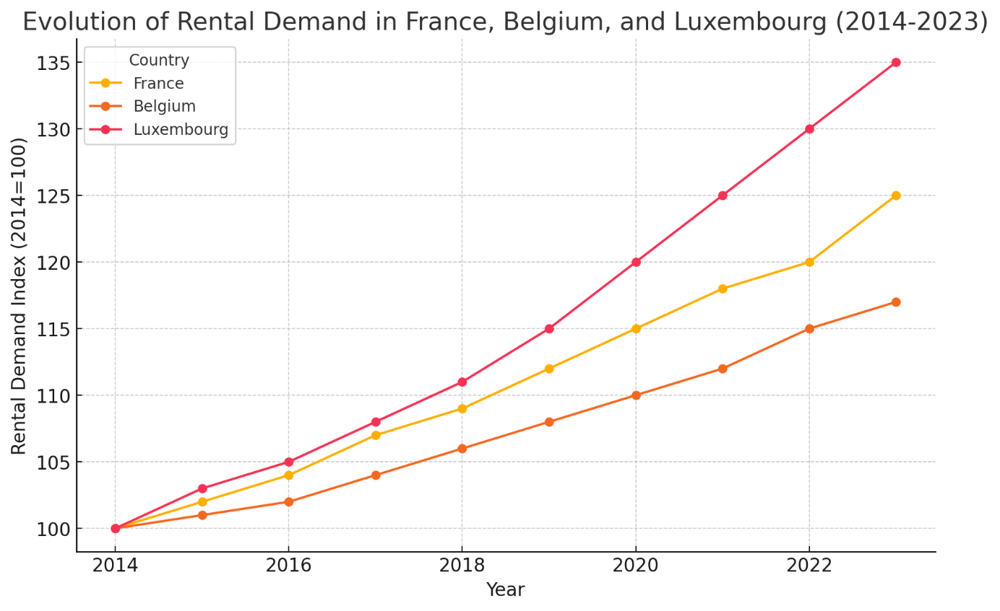

# La demande locative explose en France, Belgique et Luxembourg ! 📈

## Teaser:
Entre hausse des loyers, rareté des biens et tensions dans les grandes villes, le marché locatif est en pleine ébullition. Quels sont les chiffres et facteurs qui transforment ces marchés ? Découvrez en quelques lignes les grandes tendances et évolutions des dix dernières années. 🔍🏠

## Text:

Au cours des dix dernières années, la demande locative a évolué de manière marquée en France, en Belgique et au Luxembourg, avec des tendances principalement influencées par l'accès au crédit, les fluctuations des taux d'intérêt et les changements dans les comportements de logement.

---

### France
En France, la demande locative a crû régulièrement, en particulier dans les grandes villes et les zones à forte tension immobilière comme Paris, Lyon et Bordeaux. Avec une baisse de l'offre locative de plus de 30 % en trois ans, les loyers ont suivi une tendance haussière (+4,6 % depuis 2021) en raison de la rareté des biens disponibles et de la demande croissante. L’Île-de-France reste particulièrement tendue, où des facteurs comme la crise sanitaire et les nouvelles normes énergétiques ont influencé le marché.

Entre 2021 et 2023 :
- **Offre en baisse** : L'offre locative a chuté de -36 % en deux ans, avec un recul de 9,1 % rien qu’entre janvier 2021 et janvier 2022. Ce phénomène est amplifié dans les zones urbaines où la demande reste forte.
- **Loyers en hausse** : Les loyers ont augmenté en moyenne de +4,6 % sur trois ans, avec une hausse notable de 3,5 % en 2023 malgré le bouclier loyer, une mesure du gouvernement pour limiter cette inflation locative.
- **Tension en Île-de-France** : Dans cette région, l'attractivité reste importante ; environ 26 % des recherches locatives en France sont concentrées en Île-de-France, avec un stock de logements à louer qui a diminué de -74 % à Paris ces trois dernières années, exacerbant la crise locative.

### Belgique
En Belgique, la demande locative a également augmenté, notamment dans les grandes villes telles que Bruxelles et Gand. Environ 29 % des Belges sont locataires, un pourcentage qui est en hausse dans les centres urbains. Cependant, la tendance à l’accession à la propriété reste forte, créant une demande locative stable mais légèrement moins tendue que dans les autres pays. Les variations du marché se reflètent surtout dans les écarts de prix selon les régions et les niveaux de performance énergétique, qui impactent également les loyers.

- **Taux de locataires** : Environ 29 % des Belges sont locataires (chiffre en croissance en zone urbaine), et cette proportion monte dans des villes comme Bruxelles et Gand, où l'attrait pour la location reste élevé en raison des prix d’achat de plus en plus élevés.
- **Écarts de loyers** : Les loyers varient fortement selon la région et les caractéristiques énergétiques. Par exemple, des biens bien classés énergétiquement peuvent afficher des prix supérieurs de 30 % par rapport à des logements énergivores. En conséquence, la demande locative s’est accentuée dans des zones moins onéreuses et bien situées, comme certaines villes de Flandre orientale.

### Luxembourg
Au Luxembourg, la demande locative a explosé ces dernières années, accentuée par des prix d’achat élevés et l'augmentation des taux d'intérêt depuis 2022. Ce phénomène a poussé de nombreux résidents, notamment les expatriés, à opter pour la location. En conséquence, les loyers ont fortement augmenté, atteignant des niveaux records dans des quartiers populaires de Luxembourg Ville. La rareté des biens disponibles pour une population croissante alimente également cette hausse, créant un marché particulièrement tendu pour les locataires.

- **Hausse des loyers** : En raison d'une demande accrue depuis 2022, les loyers des appartements d’une chambre à Luxembourg Ville se situent désormais entre 1 500 € et 2 000 € par mois, et pour deux chambres, entre 2 100 € et 2 600 € (charges exclues).
- **Impact des taux d’intérêt** : L'augmentation des taux d’intérêt a incité de nombreux acheteurs potentiels à rester locataires, augmentant la demande de manière significative et exerçant une pression à la hausse sur les loyers. Les expatriés, attirés par les opportunités professionnelles au Luxembourg, contribuent également à cette tendance, renforçant la demande dans le secteur locatif.
- **Tension locative** : La rareté des biens disponibles combinée à la demande croissante rend le marché locatif luxembourgeois particulièrement compétitif, surtout pour les biens de standing moyen à élevé.

Ces tendances montrent une forte demande locative en hausse dans les trois pays, bien que le niveau de tension et les facteurs influents varient selon les spécificités économiques et les politiques de chaque région.

### Evolution of Rental Demand in France, Belgium, and Luxembourg (2014-2023)

Ce graphique traduit l'évolution de la demande locative en France, Belgique et Luxembourg de 2014 à 2023. L'indice de demande est normalisé à 100 en 2014 pour chaque pays, montrant ainsi la croissance de la demande locative au fil des années. On observe que :
- **France** a une demande croissante, particulièrement marquée dans les grandes villes.
- **Belgique** montre une augmentation plus modérée, stable mais notable dans les centres urbains.
- **Luxembourg** connaît une forte croissance, en raison des prix d'achat élevés et des récents taux d'intérêt qui ont poussé les résidents vers la location.

On y voit les disparités et la progression de la tension locative dans chaque pays.

Sources ([Meilleurs Agents](https://edito.meilleursagents.com/conseils-d-experts/louer/bilan-marche-de-location-2023-article-18136.html), [Belfius Bank](https://www.belfius.be/retail/fr/publications/actualite/2022-w19/analyse-immobilier/index.aspx), [LocService](https://www.locservice.fr/_media/LocService%20fr%20-%20Observatoire_2024_National.pdf), [Management Mobility Consulting](https://www.management-mobility.fr/actualites.html/Le-marche-immobilier-du-Luxembourg--analyse-de-la-demande-locative-en-2024-newsdetail.html))